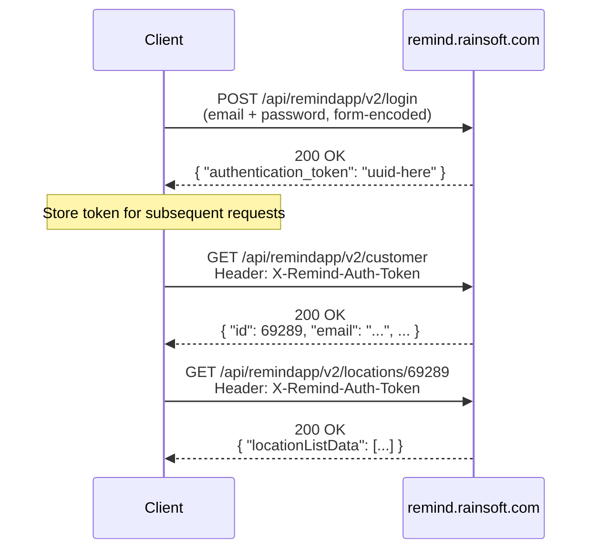
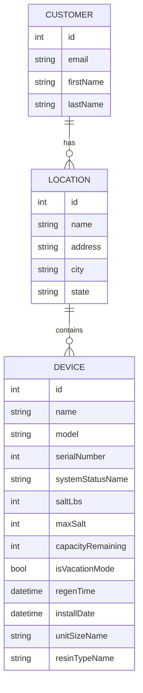
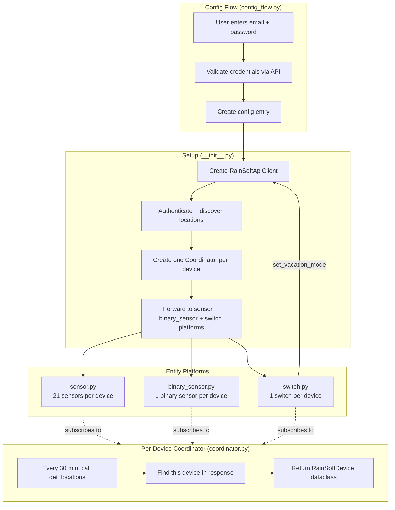
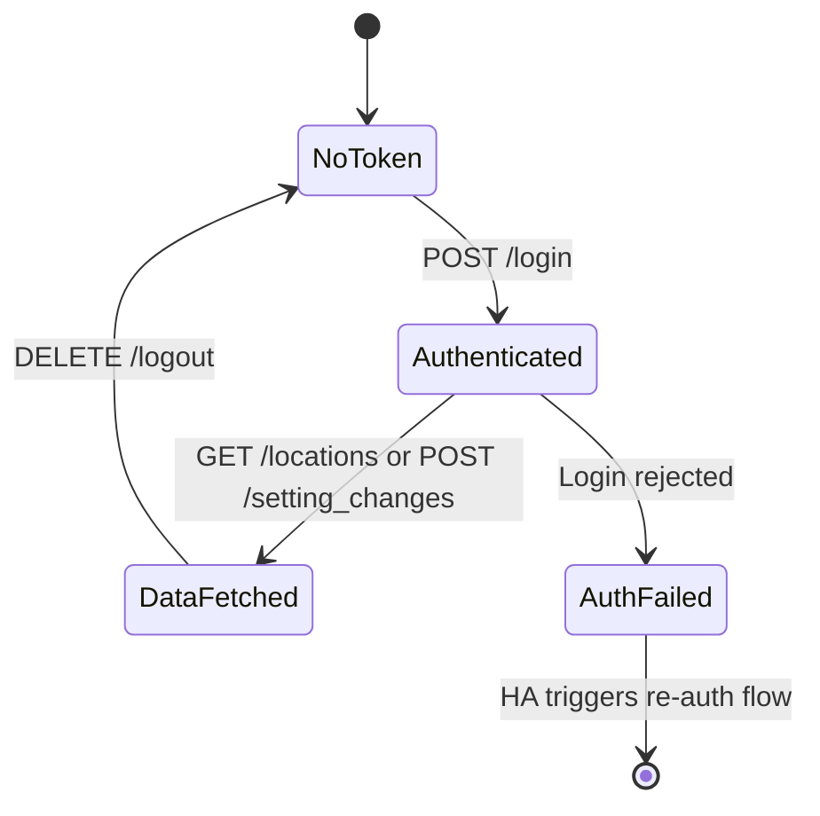

# Architecture

This document explains how the RainSoft Home Assistant integration works under the hood.

## API Discovery

RainSoft does not publish a public API. This integration uses the same JSON API as the **RainSoft Remind mobile app** (iOS/Android), discovered via traffic interception. The API lives at `https://remind.rainsoft.com/api/remindapp/v2/`.

## Authentication Flow



- **Login** is a simple form-encoded POST (no anti-forgery tokens, no cookies required)
- The API returns a **UUID auth token** used in the `X-Remind-Auth-Token` header
- The **customer ID** is fetched from `/customer` — it's the account-level identifier
- **Locations** contain devices — one account can have multiple locations, each with multiple devices

## API Endpoints

| Method | Path | Auth | Purpose |
|--------|------|------|---------|
| POST | `/api/remindapp/v2/login` | None | Authenticate, returns token |
| GET | `/api/remindapp/v2/customer` | Token | Get customer profile + ID |
| GET | `/api/remindapp/v2/locations/{customerId}` | Token | Get all locations + devices |
| POST | `/api/remindapp/v2/device/{deviceId}/setting_changes` | Token | Push device setting changes |
| DELETE | `/api/remindapp/v2/logout` | Token | Invalidate auth token |

## Data Model



## Home Assistant Integration Architecture



## Key Design Decisions

### Login-Fetch-Logout Pattern
Every data fetch follows the pattern: **login → fetch → logout**. The auth token is created, used, and immediately invalidated within a single operation. No tokens are left alive between polling intervals. This eliminates token expiry concerns and minimizes the attack surface.

### One Coordinator Per Device
Each physical device gets its own `DataUpdateCoordinator`. If one device fails to update, others remain available. The coordinators share the same `RainSoftApiClient` instance. An `asyncio.Lock` ensures only one login-fetch-logout cycle runs at a time.

### No External Dependencies
The integration has **zero pip requirements** beyond what Home Assistant already provides. The JSON API only needs `aiohttp`, which is bundled with HA. This makes installation simpler and avoids dependency conflicts.

### Device Settings API
The `/device/{id}/setting_changes` endpoint accepts a form-encoded POST with a `settingChanges` parameter containing a JSON array of setting objects. Each object has the setting name, value, and a timestamp. The integration uses this to toggle vacation mode:

```json
[{"vacation_mode": "1", "set_at": "2026-03-04T01:04:40.077Z"}]
```

The switch entity calls `set_vacation_mode()` on the API client, which follows the same login-post-logout atomic pattern. After the API call succeeds, the coordinator is refreshed to confirm the new state.

### Auto-Discovery
Users only provide email + password. The integration automatically:
1. Fetches the customer ID from `/customer`
2. Fetches all locations from `/locations/{id}`
3. Creates entities for every device found

## File Structure

```
custom_components/rainsoft/
├── __init__.py          # Entry point: auth, discover, create coordinators
├── api.py               # API client: auth, HTTP requests, data models
├── binary_sensor.py     # Low salt binary sensor
├── config_flow.py       # UI setup wizard + options flow
├── const.py             # Constants: URLs, config keys, defaults
├── coordinator.py       # DataUpdateCoordinator (one per device)
├── manifest.json        # HA integration metadata
├── sensor.py            # 21 sensor entity descriptions
├── switch.py            # Vacation mode switch (read/write)
├── strings.json         # UI text (canonical)
└── translations/
    └── en.json          # English translations
```

## Token Lifecycle



Tokens are **never persisted** between polling intervals. Each operation (data fetch or setting change) follows an atomic login → action → logout cycle. The token is created, used for one or more API calls within the same operation, then immediately invalidated via the logout endpoint.
