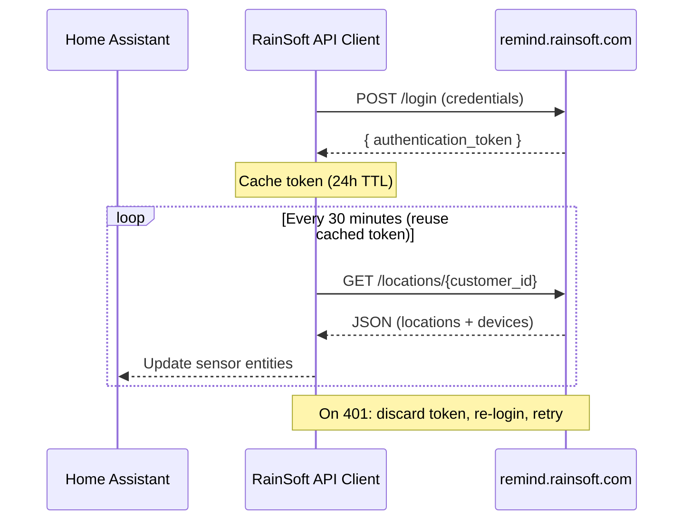

# RainSoft Water Softener Integration for Home Assistant

[](https://github.com/hacs/integration)

Monitor your RainSoft water softener through the [RainSoft Remind portal](https://remind.rainsoft.com) in Home Assistant.

> **Note:** This is an unofficial community integration. It is not affiliated with or endorsed by RainSoft.

## Features

- Auto-discovers all locations and devices on your RainSoft Remind account
- 21 sensor entities per device (water usage, salt, regeneration, water quality, system)
- 1 binary sensor entity (low salt alert)
- 1 switch entity (vacation mode toggle)
- 1 button entity (manual refresh)
- Pre-built Lovelace dashboard with gauges and history graphs
- Configurable polling interval (default: 30 minutes)
- Uses the official RainSoft Remind mobile app API (no web scraping)

## Prerequisites

You need an active account on the [RainSoft Remind portal](https://remind.rainsoft.com) with at least one connected device (e.g. EC5 water softener).

## Installation

### Via HACS (Recommended)

1. Open **HACS** > **Integrations** > three-dot menu > **Custom Repositories**
2. Add `https://github.com/MathewUlanowski/ha-rainsoft` with category **Integration**
3. Search for **RainSoft** and click **Install**
4. Restart Home Assistant

### Manual Installation

1. Download the latest release from GitHub
2. Copy the `custom_components/rainsoft/` folder into your Home Assistant `config/custom_components/` directory
3. Restart Home Assistant

## Configuration

1. Go to **Settings** > **Devices & Services** > **Add Integration**
2. Search for **RainSoft**
3. Enter your RainSoft Remind portal email and password
4. All locations and devices on your account are discovered automatically

### Options

After setup, click **Configure** on the integration to adjust:

| Option | Default | Description |
|--------|---------|-------------|
| Polling interval | 30 min | How often to fetch data (5-1440 minutes) |

## Entities

### Sensors (per device)

| Entity | Unit | Description |
|--------|------|-------------|
| Salt Remaining | lb | Current salt level in the brine tank |
| Max Salt Capacity | lb | Maximum salt capacity |
| Average Monthly Salt | lb | Average monthly salt consumption |
| Salt Used (28 Days) | lb | Salt consumed in the last 28 days |
| Capacity Remaining | grains | Remaining water softening capacity |
| Status | | Device status (e.g. "OK", "Low Salt") |
| Daily Water Use | gal | Daily water usage |
| 28-Day Water Use | gal | Water used in the last 28 days |
| Flow Since Last Regen | gal | Water flow since last regeneration |
| Lifetime Water Flow | gal | Total lifetime water flow |
| Next Regeneration | timestamp | Next scheduled regeneration time |
| Last Regeneration | timestamp | Most recent regeneration date |
| Regenerations (28 Days) | | Number of regenerations in last 28 days |
| Water Hardness | gpg | Water hardness in grains per gallon |
| Iron Level | ppm | Iron level in parts per million |
| System Pressure | psi | System pressure |
| Drain Flow Rate | gpm | Drain flow rate in gallons per minute |
| Months Since Service | months | Time since last service |
| Install Date | timestamp | When the device was installed |
| Unit Size | | System size designation |
| Resin Type | | Type of resin installed |

### Binary Sensors (per device)

| Entity | On = | Description |
|--------|------|-------------|
| Low Salt | Salt level is low | Triggers when the API reports "Low Salt" status |

### Switches (per device)

| Entity | Description |
|--------|-------------|
| Vacation Mode | Toggle vacation mode on/off via the RainSoft API |

### Buttons (per device)

| Entity | Description |
|--------|-------------|
| Refresh Data | Trigger an immediate data refresh without waiting for the next poll |

## Dashboard

A ready-to-use Lovelace dashboard is included at [`dashboards/rainsoft-dashboard.yaml`](dashboards/rainsoft-dashboard.yaml). It provides:

- **Gauges** with color-coded segments for salt level and capacity remaining
- **History graphs** for salt, daily water use, 28-day water use, and capacity
- **Controls** for vacation mode and manual refresh
- **Entity cards** for water quality, regeneration, and device info

To import: **Settings** > **Dashboards** > **Add Dashboard** > switch to YAML mode and paste the contents.

## How It Works



This integration uses the same JSON API as the RainSoft Remind mobile app. The auth token is **cached for up to 24 hours** and reused across polling intervals. If any request receives a 401, the token is automatically refreshed and the request retried.

- **Auto-discovery** of customer ID, locations, and devices
- **Cached token** with 24h TTL and automatic retry on 401
- **Multiple devices** supported with independent polling coordinators per device

## Troubleshooting

### "Invalid email or password"
Verify your credentials work at [remind.rainsoft.com](https://remind.rainsoft.com) or in the RainSoft Remind mobile app.

### "No RainSoft devices found"
Ensure your account has at least one device registered in the Remind portal.

### Entities showing "Unavailable"
The integration may temporarily lose connection to the API. It will automatically retry at the next polling interval. Check your HA logs:

```
Logger: custom_components.rainsoft
```

## Privacy & Security

- Your credentials are stored encrypted in Home Assistant's configuration store
- Credentials are only sent to `remind.rainsoft.com` (the official RainSoft portal)
- No data is sent to any third-party services

## Architecture

For a deep dive into the API, data model, auth flow, and design decisions, see [ARCHITECTURE.md](ARCHITECTURE.md).

## Contributing

Contributions are welcome! Please open an issue or pull request on [GitHub](https://github.com/MathewUlanowski/ha-rainsoft).

## License

This project is licensed under the MIT License.
